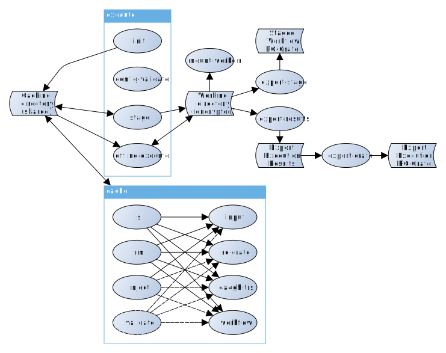

#  Workflow Execution Service backend

WfExS (which could be pronounced like "why-fex", "why-fix" or "why-fixes") project aims to automate next steps:

* Fetch and cache a workflow from either:
  * A TRSv2-enabled [WorkflowHub](https://workflowhub.eu) instance (which provides RO-Crates).
  * A TRSv2 (2.0.0-beta2 or 2.0.0) enabled service. Currently tested with [Dockstore](https://dockstore.org).
  * A straight URL to an existing [RO-Crate](https://www.researchobject.org/ro-crate/) in ZIP archive describing a workflow.
  * A git repository ([using this syntax](https://pip.pypa.io/en/stable/cli/pip_install/#git) for the URI)
  * A public GitHub URL (like [this example](https://raw.githubusercontent.com/inab/ipc_workflows/cosifer-20210322/cosifer/cwl/cosifer-workflow.cwl)).
* Identify the kind of workflow.
* Fetch and set up workflow execution engine (currently supported [Nextflow](https://www.nextflow.io/)
and [cwltool](https://github.com/common-workflow-language/cwltool)).
* Identify the needed containers by the workflow, and fetch/cache them. Depending on the local setup, `singularity`, `docker`, `podman` or none of them will be used.
* Fetch and cache the inputs, represented either through an URL or a [CURIE-represented](https://en.wikipedia.org/wiki/CURIE) PID (public [persistent identifier](https://en.wikipedia.org/wiki/Persistent_identifier)).
* Execute the workflow in a secure way, if it was requested.
* Optionally describe the results through an [RO-Crate](https://www.researchobject.org/ro-crate/), and upload both RO-Crate and the results elsewhere in a secure way.

This development is relevant for projects like [EOSC-Life](https://www.eosc-life.eu/) or [EJP-RD](https://www.ejprarediseases.org/). The list of high level scheduled and pending developments can be seen at [TODO.md](TODO.md).

In order to use it you have to install first the dependencies described at [INSTALL.md](INSTALL.md).

WfExS-backend analysis lifecycle and usage scenarios are briefly described with flowcharts at [README_LIFECYCLE.md](README_LIFECYCLE.md).

`WfExS-config-replicator.py` usage is explaied at [README_REPLICATOR.md](README_REPLICATOR.md).


## WfExS-backend Usage

```bash
python WfExS-backend.py -h
```
```
usage: WfExS-backend.py [-h] [--log-file LOGFILENAME] [-q] [-v] [-d]
                        [-L LOCALCONFIGFILENAME] [--cache-dir CACHEDIR]
                        [-W WORKFLOWCONFIGFILENAME]
                        [-Z SECURITYCONTEXTSCONFIGFILENAME]
                        [-J WORKFLOWWORKINGDIRECTORY] [--full] [-V]
                        [{init,config-validate,stage,mount-workdir,export-stage,offline-execute,execute,export-results,export-crate}]

WfExS (workflow execution service) backend 0.4.5-3-gbe1139a
(be1139ae6f2cca8f1f66c05eb6c91e9b85631d46)

positional arguments:
  {init,config-validate,stage,mount-workdir,export-stage,offline-execute,execute,export-results,export-crate}
                        Command to run

optional arguments:
  -h, --help            show this help message and exit
  --log-file LOGFILENAME
                        Store messages in a file instead of using standard
                        error and standard output
  -q, --quiet           Only show engine warnings and errors
  -v, --verbose         Show verbose (informational) messages
  -d, --debug           Show debug messages (use with care, as it can disclose
                        passphrases and passwords)
  -L LOCALCONFIGFILENAME, --local-config LOCALCONFIGFILENAME
                        Local installation configuration file
  --cache-dir CACHEDIR  Caching directory
  -W WORKFLOWCONFIGFILENAME, --workflow-config WORKFLOWCONFIGFILENAME
                        Configuration file, describing workflow and inputs
  -Z SECURITYCONTEXTSCONFIGFILENAME, --creds-config SECURITYCONTEXTSCONFIGFILENAME
                        Configuration file, describing security contexts,
                        which hold credentials and similar
  -J WORKFLOWWORKINGDIRECTORY, --staged-job-dir WORKFLOWWORKINGDIRECTORY
                        Already staged job directory (to be used with offline-
                        execute)
  --full                Should the RO-Crate contain a copy of the inputs (and
                        outputs)? (to be used with export-stage or export-
                        crate)
  -V, --version         show program's version number and exit
```

WfExS commands are:



* `init`: This command is used to initialize a WfExS installation. It takes a local configuration file through `-L` parameter, and it can both generate crypt4gh paired keys for installation work and identification purposes and update the path to them in case they are not properly defined. Those keys are needed to decrypt encrypted working directories, and in the future to decrypt secure requests and encrypt secure results.

* `config-validate`: This command is used to validate workflow staging configuration file, as well as its paired security context configuration file using the corresponding JSON Schemas. It honours `-L`, `-W` and `-Z` parameters. If command is not set, this is the default command to be run.

* `stage`: This command is used to first validate workflow staging and security context configuration files, then fetch all the workflow preconditions and files, staging them for an execution. It honours `-L`, `-W` and `-Z` parameters, and once the staging is finished it prints the path to the parent execution environment.

* `export-stage` _(to be done)_: This command is complementary to `stage`. It recognizes `-L` parameter, and depends on `-J` parameter to locate the execution environment directory to be used, properly staged through `stage`. It will bundle the description of the staged environment in an RO-Crate, in order to be reused later, or uploaded to places like WorkflowHub. All of this assuming there is an stage there.

* `offline-execute`: This command is complementary to `stage`. It recognizes `-L` parameter, and depends on `-J` parameter to locate the execution environment directory to be used, properly staged through `stage`. It executes the workflow, assuming all the preconditions are in place.

* `export-results` _(to be finished)_: This command is complementary to `offline-execute`. It recognizes `-L` parameter, and depends on `-J` parameter to locate the execution environment directory to be used, properly staged through `stage` and executed through `offline-execute`. It export the results from an execution at a working directory, assuming there is an execution there. Export rules should be described in the file used in `-W` parameter when the working directory was staged.

* `export-crate` _(to be finished)_: This command is complementary to `export-results`. It recognizes `-L` parameter, and depends on `-J` parameter to locate the execution environment directory to be used, properly staged through `stage` and executed through `offline-execute` and `export-results`. It bundles the metadata and provenance results from an execution at a working directory in an RO-Crate, assuming there is an execution there.

* `mount-workdir`: This command is a helper to inspect encrypted execution environments, as it mounts its working directory for a limited time. As `export-stage`, `offline-execute` or `export-results`, it recognizes `-L` parameter and depends on `-J` parameter.

* `execute`: This command's behaviour is equivalent to `stage` followed by `offline-execute`, `export-results` and `export-crate`.

When the execution has finished properly, the working directory `outputs` subdirectory should contain both the outputs and an `execution.crate.zip`, which can be used to create a workflow entry in <https://workflowhub.eu>.

## Configuration files

The program uses three different types of configuration files:

* Local configuration file: YAML formatted file which describes the local setup of the backend (example at [tests/local_config.yaml](tests/local_config.yaml)). JSON Schema describing the format (and used for validation) is available at [wfexs_backend/schemas/config.json](wfexs_backend/schemas/config.json) and there is also automatically generated documentation (see [config_schema.md](docs/schemas/config_schema.md)). Relative paths in this configuration file use as reference the directory where the local configuration file is living.
  
  - `cacheDir`: The path in this key sets up the place where all the contents which can be cached are hold. It contains downloaded RO-Crate,
     downloaded workflow git repositories, downloaded workflow engines. It is recommended to have it outside `/tmp` directory when
     Singularity is being used, due undesirable side interactions with the way workflow engines use Singularity.
  
  - `workDir`: The path in this key sets up the place where all the executions are going to store both intermediate and final results,
    having a separate directory for each execution. It is recommended to have it outside `/tmp` directory when Singularity is being
    used, due undesirable side interactions with the way workflow engines use Singularity.
  
  - `crypt4gh.key`: The path to the secret key used in this installation. It is paired to `crypt4gh.pub`.
  
  - `crypt4gh.pub`: The path to the public key used in this installation. It is paired to `crypt4gh.key`.
  
  - `crypt4gh.passphrase`: The passphrase needed to decrypt the contents of `crypt4gh.key`.
  
  - `tools.engineMode`: Currently, local mode only.
  
  - `tools.containerType`: Currently, `singularity`, `docker` or `podman`.
  
  - `tools.gitCommand`: Path to `git` command (only used when needed)

  - `tools.dockerCommand`: Path to `docker` command (only used when needed)

  - `tools.singularityCommand`: Path to `singularity` command (only used when needed)

  - `tools.podmanCommand`: Path to `podman` command (only used when needed)

  - `tools.javaCommand`: Path to `java` command (only used when needed)
  
  - `tools.encrypted_fs.type`: Kind of FUSE encryption filesystem to use for secure working directories. Currently, both `gocryptfs` and `encfs` are supported.
  
  - `tools.encrypted_fs.command`: Command path to be used to mount the secure working directory. The default depends on value of `tools.encrypted_fs.type`.
  
  - `tools.encrypted_fs.fusermount_command`: Command to be used to unmount the secure working directory. Defaults to `fusermount`.
  
  - `tools.encrypted_fs.idle`: Number of minutes of inactivity before the encrypted FUSE filesystem is automatically unmounted. The default is 5 minutes.
  
* Workflow configuration file: YAML formatted file which describes the workflow staging before being executed, like where inputs are located and can be fetched, the security contexts to be used on specific inputs to get those controlled access resources, the parameters, the outputs to capture, ... ([Nextflow example](tests/wetlab2variations_execution_nxf.wfex.stage), [CWL example](tests/wetlab2variations_execution_cwl.wfex.stage)). JSON Schema describing the format and valid keys (and used for validation), is available at [wfexs_backend/schemas/stage-definition.json](wfexs_backend/schemas/stage-definition.json) and there is also automatically generated documentation (see [stage-definition_schema.md](docs/schemas/stage-definition_schema.md)).

* Security contexts file: YAML formatted file which holds the `user`/`password` pairs, security tokens or keys needed on different steps, like input fetching. ([Nextflow example](tests/wetlab2variations_credentials_nxf.wfex.ctxt), [CWL example](tests/wetlab2variations_credentials_cwl.wfex.ctxt)). JSON Schema describing the format and valid keys (and used for validation), is available at [wfexs_backend/schemas/security-context.json](wfexs_backend/schemas/security-context.json) and there is also automatically generated documentation (see [security-context_schema.md](docs/schemas/security-context_schema.md)).

## License
* © 2020-2021 Barcelona Supercomputing Center (BSC), ES

Licensed under the Apache License, version 2.0 <https://www.apache.org/licenses/LICENSE-2.0>, see the file `LICENSE.txt` for details.
