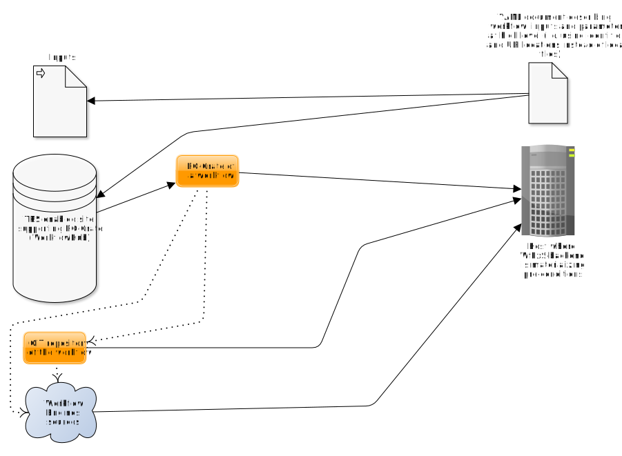

#  Workflow Execution Service backend

WfExS (which could be pronounced like "why-fex", "why-fix" or "why-fixes") project aims to fetch a workflow from a TRS-enabled [WorkflowHub](https://workflowhub.eu) instance,
fetch the inputs and workflow execution engine (currently working on [Nextflow](https://www.nextflow.io/)
and [cwltool](https://github.com/common-workflow-language/cwltool)), and execute the workflow in a
secure way.

This development is relevant for projects like [EOSC-Life](https://www.eosc-life.eu/) or [EJP-RD](https://www.ejprarediseases.org/). The list of high level scheduled and pending developments can be seen at [TODO.md](TODO.md).

In order to use it you have to install first the dependencies described at [INSTALL.md](INSTALL.md).

## Usage

```
python WfExS-backend.py -h
usage: WfExS-backend.py [-h] [--log-file LOGFILENAME] [-q] [-v] [-d]
                        [-L LOCALCONFIGFILENAME] [--cache-dir CACHEDIR]
                        [-W WORKFLOWCONFIGFILENAME]
                        [-Z SECURITYCONTEXTSCONFIGFILENAME]
                        [-J WORKFLOWWORKINGDIRECTORY]
                        [{init,stage,mount-workdir,offline-execute,execute}]

WfExS (workflow execution service) backend

positional arguments:
  {init,stage,mount-workdir,offline-execute,execute}
                        Command to run

optional arguments:
  -h, --help            show this help message and exit
  --log-file LOGFILENAME
                        Store messages in a file instead of using standard
                        error and standard output
  -q, --quiet           Only show engine warnings and errors
  -v, --verbose         Show verbose (informational) messages
  -d, --debug           Show debug messages (use with care, as it can disclose
                        passphrases and passwords)
  -L LOCALCONFIGFILENAME, --local-config LOCALCONFIGFILENAME
                        Local installation configuration file
  --cache-dir CACHEDIR  Caching directory
  -W WORKFLOWCONFIGFILENAME, --workflow-config WORKFLOWCONFIGFILENAME
                        Configuration file, describing workflow and inputs
  -Z SECURITYCONTEXTSCONFIGFILENAME, --creds-config SECURITYCONTEXTSCONFIGFILENAME
                        Configuration file, describing security contexts,
                        which hold credentials and similar
  -J WORKFLOWWORKINGDIRECTORY, --staged-job-dir WORKFLOWWORKINGDIRECTORY
                        Already staged job directory (to be used with offline-
                        execute)
```

WfExS commands are:


* `init`: This command is used to initialize a WfExS installation. It takes a local configuration file through `-L` parameter, and it can both generate crypt4gh paired keys for installation work and identification purposes and update the path to them in case they are not properly defined. Those keys are needed to decrypt encrypted working directories, and in the future to decrypt secure requests and encrypt secure results.

* `stage`: This command is used to fetch all the workflow preconditions and files, staging them for an execution. It honours `-L`, `-W` and `-Z` parameters, and once the staging is finished it prints the path to the parent execution environment.

* `offline-execute`: This command is complementary to `stage`. It recognizes `-L` parameter, and depends on `-J` parameter to locate the execution environment directory to be used, properly staged through `stage`.

* `mount-workdir`: This command is a helper to inspect encrypted execution environments, as it mounts its working directory for a limited time. As `offline-execute`, it recognizes `-L` parameter and depends on `-J` parameter.

* `execute`: This command's behaviour is equivalent to `stage` followed by `offline-execute`.

When the execution has finished properly, the working directory `outputs` subdirectory should contain both the outputs and an `execution.crate.zip`, which can be used to create a workflow entry in <https://workflowhub.eu>.

## Configuration files

The program uses three different types of configuration files:

* Local configuration file: It describes the local setup of the backend (example at [tests/local_config.yaml](tests/local_config.yaml)). Relative paths in this configuration file use as reference the directory where the local configuration file is living.
  
  - `cacheDir`: The path in this key sets up the place where all the contents which can be cached are hold. It contains downloaded RO-Crate,
     downloaded workflow git repositories, downloaded workflow engines. It is recommended to have it outside `/tmp` directory,
     due undesirable side interactions with the way workflow engines use Singularity.
  
  - `workDir`: The path in this key sets up the place where all the executions are going to store both intermediate and final results,
    having a separate directory for each execution. It is recommended to have it outside `/tmp` directory, due undesirable side
    interactions with the way workflow engines use Singularity.
  
  - `crypt4gh.key`: The path to the secret key used in this installation. It is paired to `crypt4gh.pub`.
  
  - `crypt4gh.pub`: The path to the public key used in this installation. It is paired to `crypt4gh.key`.
  
  - `crypt4gh.passphrase`: The passphrase needed to decrypt the contents of `crypt4gh.key`.
  
  - `tools.engineMode`: Currently, local mode only.
  
  - `tools.containerType`: Currently, singulary.
  
  - `tools.gitCommand`: Path to git command

  - `tools.dockerCommand`: Path to docker command (only used when needed)

  - `tools.singularityCommand`: Path to singularity command (only used when needed)

  - `tools.javaCommand`: Path to java command (only used when needed)
  
  - `tools.encrypted_fs.type`: Kind of FUSE encryption filesystem to use for secure working directories. Currently only `encfs` is supported.
  
  - `tools.encrypted_fs.command`: Command path to be used to mount the secure working directory. The default depends on value of `tools.encrypted_fs.type`.
  
  - `tools.encrypted_fs.fusermount_command`: Command to be used to unmount the secure working directory. Defaults to `fusermount`.
  
  - `tools.encrypted_fs.idle`: Number of minutes of inactivity before the encrypted FUSE filesystem is automatically unmounted. The default is 5 minutes.
  
* Workflow configuration file: _TO BE DOCUMENTED_ ([Nextflow example](tests/wetlab2variations_execution_nxf.yaml), [CWL example](tests/wetlab2variations_execution_cwl.yaml)).

* Security contexts file: _TO BE DOCUMENTED_ ([Nextflow example](tests/wetlab2variations_credentials_nxf.yaml), [CWL example](tests/wetlab2variations_credentials_cwl.yaml)).

# Scenarios
## WorkflowHub scenario

<span style="display:block;text-align:center">

</span>

## GitHub repo scenario
<span style="display:block;text-align:center">

</span>
