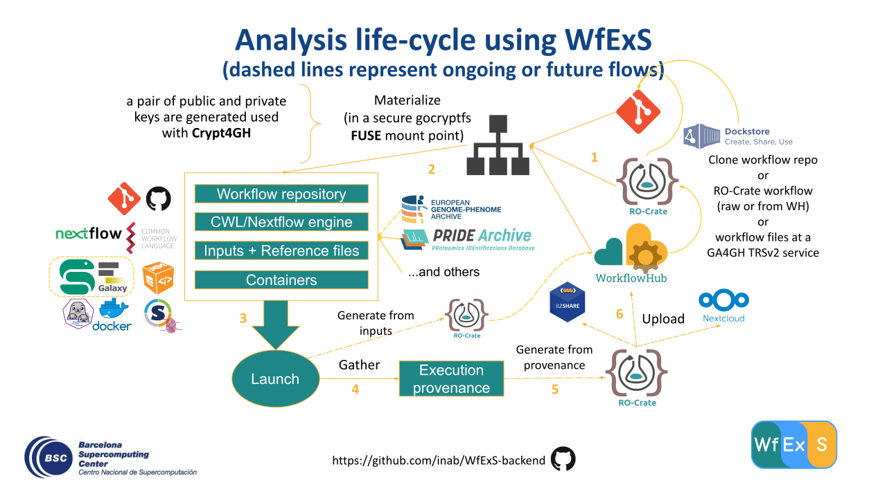
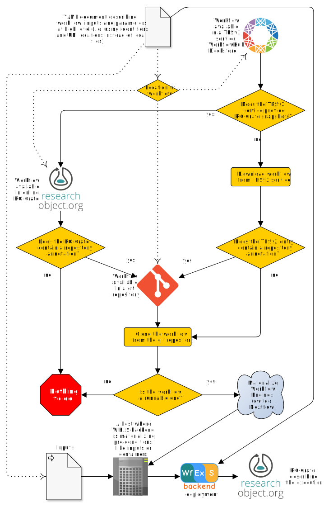

#  Workflow Execution Service backend

## WfExS-backend analysis life cycle

## WfExS-backend usage scenarios (version 0.4)

## Scenarios (version 0.3)
### WorkflowHub scenario

### GitHub repo scenario

## License
* © 2020-2021 Barcelona Supercomputing Center (BSC), ES

Licensed under the Apache License, version 2.0 <https://www.apache.org/licenses/LICENSE-2.0>, see the file `LICENSE.txt` for details.
