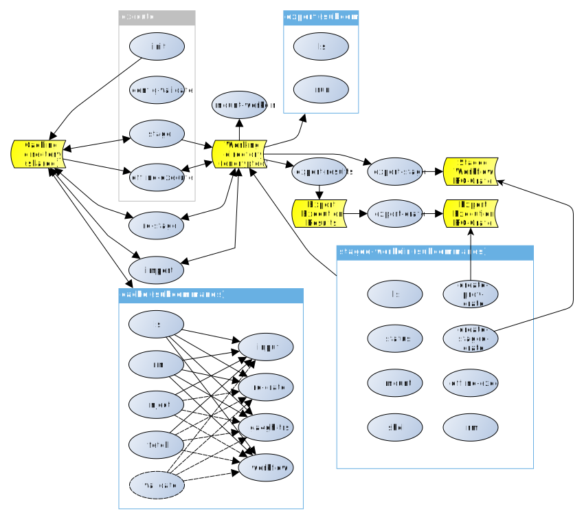

Command-line description
===

WfExS main directives are:

* `init`: This command is used to initialize a WfExS installation. It takes a local configuration file through `-L` parameter, and it can both generate crypt4gh paired keys for installation work and identification purposes and update the path to them in case they are not properly defined. Those keys are needed to decrypt encrypted working directories, and in the future to decrypt secure requests and encrypt secure results.

* `config-validate`: This command is used to validate workflow staging configuration file, as well as its paired security context configuration file using the corresponding JSON Schemas. It honours `-L`, `-W`, `-Z` parameters and `WFEXS_CONFIG_FILE` environment variable. If command is not set, this is the default command to be run.

* `cache`: This command is used to manage the different caches, helping in their own lifecycle (list, fetch, inject, validate, remove). It recognizes both `-L` parameter and `WFEXS_CONFIG_FILE` environment variable.

* `stage`: This command is used to first validate workflow staging and security context configuration files, then fetch all the workflow preconditions and files, staging them for an execution. It honours `-L`, `-W`, `-Z` parameters and `WFEXS_CONFIG_FILE` environment variable, and once the staging is finished it prints the path to the parent execution environment.

* `re-stage`: This command is used to reuse an already staged workflow in a completely uncoupled working directory. The command allows replacing some of the parameters.

* `import`: This command is used to fetch and import a previously generated Workflow Run RO-Crate, for reproducibility. The command allows replacing some of the original parameters, for replicability.

* `staged-workdir`: This command is complementary to `stage`. It recognizes both `-L` parameter and `WFEXS_CONFIG_FILE` environment variable. This command has several subcommands which help on the workflow execution lifecycle (list available working directories and their statuses, remove some of them, execute either a shell or a custom command in a working directory context, execute, export prospective and retrospective provenance to RO-Crate, ...).

* `export`: This command is complementary to `stage`. It recognizes both `-L` parameter and `WFEXS_CONFIG_FILE` environment variable, and depends on `-J` parameter to locate the execution environment directory to be used, properly staged through `stage`. It also depends on both -E and -Z parameters, to declare the different export patterns and the needed credentials to complete the rules. This command has a couple of subcommands to list previously exported items and to do those exports.

* `export-stage` _(to be done)_: This command is complementary to `stage`. It recognizes both `-L` parameter and `WFEXS_CONFIG_FILE` environment variable, and depends on `-J` parameter to locate the execution environment directory to be used, properly staged through `stage`. It will bundle the description of the staged environment in an RO-Crate, in order to be reused later, or uploaded to places like WorkflowHub. All of this assuming there is an stage there.

* `offline-execute`: This command is complementary to `stage`. It recognizes both `-L` parameter and `WFEXS_CONFIG_FILE` environment variable, and depends on `-J` parameter to locate the execution environment directory to be used, properly staged through `stage`. It executes the workflow, assuming all the preconditions are in place.

* `export-results`: This command is complementary to `offline-execute`. It recognizes both `-L` parameter and `WFEXS_CONFIG_FILE` environment variable, and depends on `-J` parameter to locate the execution environment directory to be used, properly staged through `stage` and executed through `offline-execute`. It export the results from an execution at a working directory, assuming there is an execution there. Export rules should be described in the file used in `-W` parameter when the working directory was staged.

* `export-crate`: This command is complementary to `export-results`. It recognizes both `-L` parameter and `WFEXS_CONFIG_FILE` environment variable, and depends on `-J` parameter to locate the execution environment directory to be used, properly staged through `stage` and executed through `offline-execute` and `export-results`. It bundles the metadata and provenance results from an execution at a working directory in an RO-Crate, assuming there is an execution there.

* `mount-workdir`: This command is a helper to inspect encrypted execution environments, as it mounts its working directory for a limited time. As `export-stage`, `offline-execute` or `export-results`, it recognizes both `-L` parameter and `WFEXS_CONFIG_FILE` environment variable, and depends on `-J` parameter.

* `execute`: This command's behaviour is equivalent to `stage` followed by `export-stage`, `offline-execute`, `export-results` and `export-crate`.

When the execution has finished properly, the working directory `outputs` subdirectory should contain both the outputs and an `execution.crate.zip`, which can be used to create a workflow entry in <https://workflowhub.eu>.
